# Création d'une API REST avec Express.js pour une Plateforme de Réservation de voyages

    nous souhaitons développer un programme java permettant de simuler la commande «ls», cette commande est utilisée pour lister les informations sur les fichiers et les répertoires d’un
    répertoire donné.

    Nous devons créer une API REST pour gérer une plateforme de réservation de voyages.
    L'API permettre de gérer les destinations, les voyageurs, et les réservations.

<h4>Modèles<h4>

Voici la structure des modeles et les relation entre elles
 
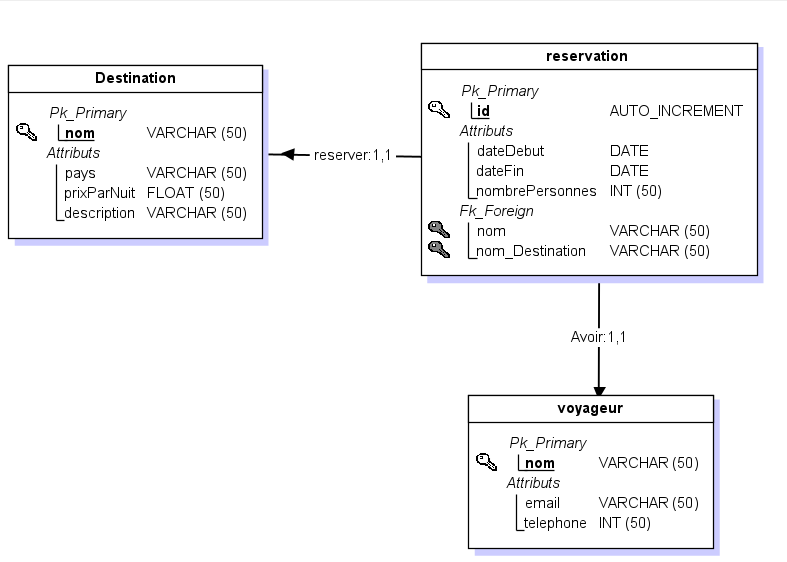

<h4>Dévéloppement des modèles<h4>
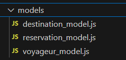

   Dans le dossier models, nous allons créer les trois modèles mongoose (Destination, Voyageur et Réservation)  
   <h5>Modèle Destination</h5> 
   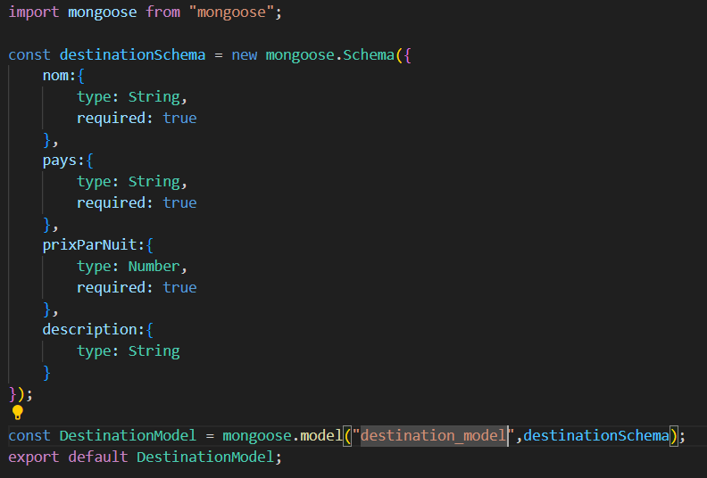  

   <h5>Modèle Destination</h5> 
   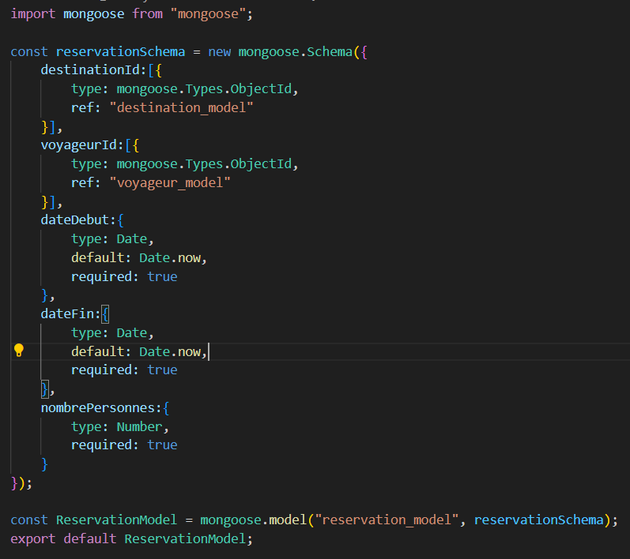  

   <h5>Modèle Destination</h5> 
   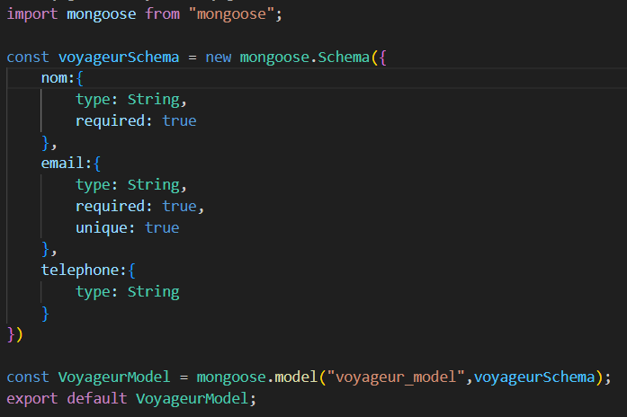  

<h4>Dévéloppement des Services<h4>
 Dans le dossier services, nous allons créer
    pour chaque modèle un service. 
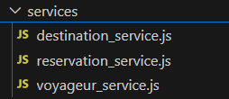  

    <h5>Service Destination</h5> 
    destination_service.js: Pour gérer la création, la mise à jour, la suppression et la recherche de destinations.  
    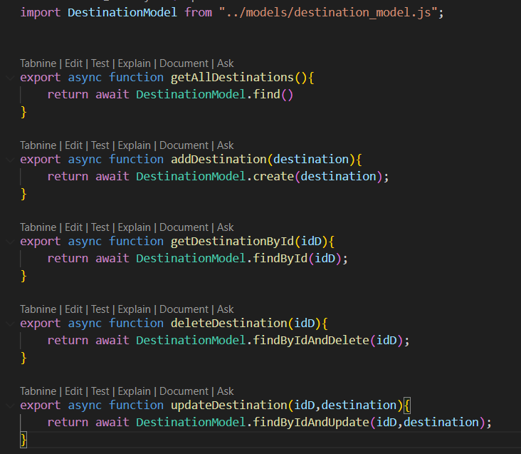  

    <h5>Service Voyageur</h5> 
    voyageur_service.js: Pour gérer les voyageurs et leurs informations.  
    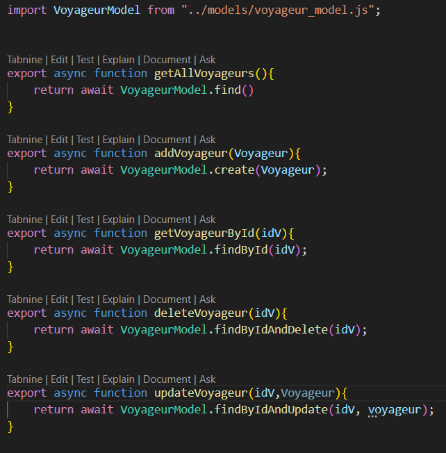  

    <h5>Service reservation</h5> 
    reservation_service.js: Pour gérer les reservation, y compris le calcul du prix total basé sur la durée du séjour et le prix par nuit de la destination.  
    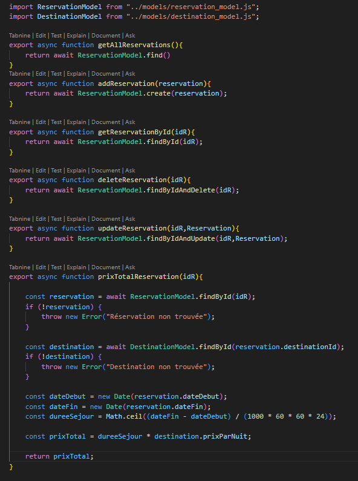  

<h4>Dévéloppement des Contrôleurs<h4>
 Dans le dossier controlleurs, nous allons créer
    pour chaque modèle un contrôlleur qui doit appeler le service correspondants. 
  

    <h5>Controlleur destination</h5> 
    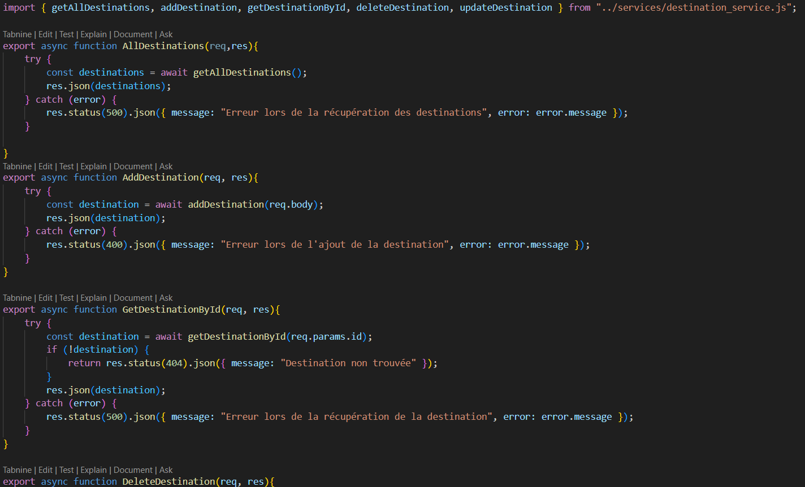  

    <h5>Controlleur voyageur</h5> 
    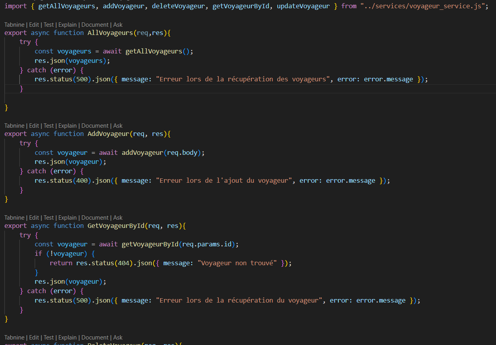  

    <h5>Controlleur reservation</h5> 
    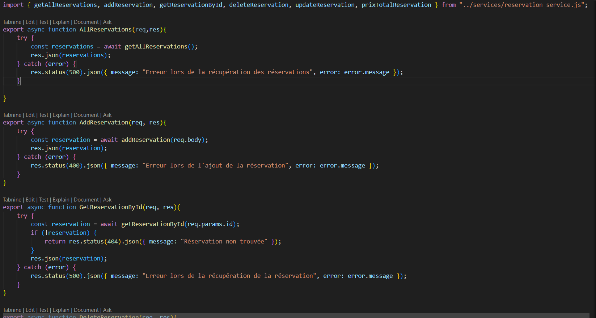  

